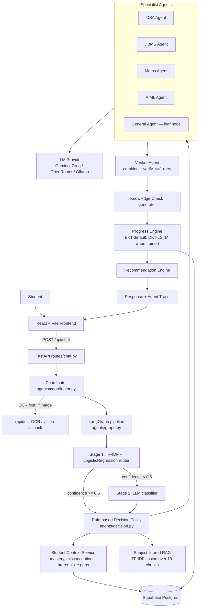

<div align="center">


### One student. A hive of AI tutors. One intelligent learning journey.

**EduHive** is an agentic learning platform for Indian tech-placement preparation that combines
trained ML routing, specialist AI tutors, retrieval, verification, learner modeling, and adaptive recommendations.

<p>
  <a href="#whats-actually-implemented">Features</a> •
  <a href="#architecture">Architecture</a> •
  <a href="#request-flow-one-chat-turn">Request Flow</a> •
  <a href="#the-five-agents">AI Tutors</a> •
  <a href="#getting-started">Getting Started</a> •
  <a href="#api-reference">API</a>
</p>

</div>

---

## Why EduHive?

EduHive treats learning as a **continuous, observable system**, not just a chatbot.

**Question → Route → Understand learner → Teach → Verify → Assess → Update mastery → Recommend next action**

Every routing decision is captured in an **Agent Trace**, making the system inspectable rather than a black box.

> **Product name:** EduHive  
> **Original internal codename:** LearnOS — a few comments and document titles may still use the old name.

---

## Table of contents

- [What's actually implemented](#whats-actually-implemented)
- [Architecture](#architecture)
- [Request flow](#request-flow-one-chat-turn)
- [The five agents](#the-five-agents)
- [Two-stage routing](#two-stage-routing)
- [Learner model & Progress Engine](#learner-model--progress-engine)
- [RAG knowledge layer](#rag-knowledge-layer)
- [Database schema](#database-schema)
- [Authentication](#authentication)
- [API reference](#api-reference)
- [Tech stack](#tech-stack)
- [Project layout](#project-layout)
- [Getting started](#getting-started)
- [Environment variables](#environment-variables)
- [Known gaps / honesty section](#known-gaps--honesty-section)

---

## What's actually implemented

This section exists because hackathon READMEs tend to oversell. Everything below is verified against the code, not the pitch deck.

| Capability | Status | Where |
|---|---|---|
| Two-stage routing (trained TF-IDF → LLM fallback) | ✅ Live | [`backend/app/agents/router.py`](backend/app/agents/router.py) |
| LangGraph orchestration (11-node pipeline) | ✅ Live, with sequential fallback | [`backend/app/agents/graph.py`](backend/app/agents/graph.py) |
| Rule-based coordinator decision policy | ✅ Live | [`backend/app/agents/decision.py`](backend/app/agents/decision.py) |
| 5 specialist agents + verifier/guardrail agent | ✅ Live | [`backend/app/agents/`](backend/app/agents/) |
| Multi-agent collaboration (runner-up routing) | ✅ Live | router probability ≥ 0.25 |
| Subject-filtered RAG (19 curated chunks) | ✅ Live | [`backend/app/knowledge/`](backend/app/knowledge/) |
| Structured verification + single corrective retry | ✅ Live | [`verifier_agent.py`](backend/app/agents/verifier_agent.py) |
| Shared student context assembly | ✅ Live | [`context_service.py`](backend/app/services/context_service.py) |
| BKT mastery scoring + cross-subject root-cause detection | ✅ Live | [`progress_engine.py`](backend/app/services/progress_engine.py) |
| DKT-LSTM (deep-learning mastery tier) | ⚠️ Implemented, **not trained/shipped** — no `dkt_model.pt` in the repo, loader falls back to BKT | [`ml/dkt/`](ml/dkt/) |
| Rule-based next-best-action recommendations | ✅ Live | [`recommendation_engine.py`](backend/app/services/recommendation_engine.py) |
| Conversation history (resumable threads) | ✅ Live | [`conversation_service.py`](backend/app/services/conversation_service.py) |
| Agent Trace panel (real execution events, not scripted) | ✅ Live | [`trace.py`](backend/app/services/trace.py) → `AgentTracePanel.jsx` |
| OCR for photographed questions | ✅ Live (`rapidocr-onnxruntime`, offline) | [`ocr.py`](backend/app/services/ocr.py) |
| Voice input | ✅ Live (browser Web Speech API, no backend involvement) | [`useSpeechRecognition.js`](frontend/src/hooks/useSpeechRecognition.js) |
| 11-language UI + answers (English + 10 Indian languages) | ✅ Live | [`frontend/src/i18n/`](frontend/src/i18n/), [`agents/language.py`](backend/app/agents/language.py) |
| Supabase Auth (email/password + Google OAuth) with local-storage fallback | ✅ Live | [`AuthContext.jsx`](frontend/src/context/AuthContext.jsx) |
| Human-teacher escalation rule (3+ failures, mastery < 40%) | ✅ Live | [`student_service.py`](backend/app/services/student_service.py) |
| Standalone ML microservice routes (`/api/ml/route`, `/dkt-mastery`, ...) | ⚠️ Code exists but **not mounted** in the FastAPI app — dead code | [`routes/ml.py`](backend/app/routes/ml.py) not imported by [`routes/api.py`](backend/app/routes/api.py) |
| Knowledge Map / Progress roadmap benchmarks | ⚠️ Partly mock UI — no backend equivalent yet | [`frontend/src/data/mockData.js`](frontend/src/data/mockData.js) |
| Telemetry streaming | ⚠️ Poll-based (manual refresh of `/trace`), not SSE/websocket | `LiveTelemetryStream.jsx` |

See [Known gaps / honesty section](#known-gaps--honesty-section) for the full list with reasoning.

---

## Architecture

The three-tier ML/AI split is a deliberate engineering decision, not an accident — named explicitly because it's the honest answer to "did you train anything, or is this just prompting an LLM?"

- **Classical ML** — TF-IDF + Logistic Regression subject router. Small, fast, deterministic, explainable.
- **Deep learning** — DKT (LSTM over skill/correctness sequences). Trainable notebook ships; the trained artifact does not (see gaps).
- **Agentic GenAI** — the five specialists, cross-agent synthesis, misconception diagnosis, natural-language teaching. This is where an LLM is the right tool.



---

## Request flow (one chat turn)

`POST /api/chat` runs an 11-node LangGraph pipeline (falls back to the same nodes run sequentially if LangGraph is unavailable — no optional subsystem can take down chat):

1. **`ingest_request`** — record the query
2. **`router_result`** — trained TF-IDF classifier (stage 1)
3. **`load_student_context`** — mastery, misconceptions, prerequisite gaps
4. **`coordinator_decision`** — which agents, which teaching strategy, whether to ground/verify/quiz
5. **`retrieve_knowledge`** — subject-filtered RAG *(conditional — skipped for trivial messages)*
6. **`execute_specialists`** — primary agent + any supporting agents
7. **`verifier`** — structured verdict, at most one corrective pass *(conditional)*
8. **`knowledge_check`** — generated quiz question *(conditional)*
9. **`update_mastery`** — routing log + conversation persisted
10. **`recommendation`** — next-best-action recomputed
11. **`finalize_response`**

Every node appends a `TraceEvent` with a `status` of `ok`, `skipped`, or `failed` — steps the coordinator deliberately skips are recorded as such, so the Agent Trace panel shows real decisions rather than a fixed storyboard.

**Image questions run OCR before the graph.** A photographed question is transcribed first (`rapidocr-onnxruntime`, pure pip, offline — no Tesseract) and the *extracted text* is what gets routed, so it reaches the right specialist instead of defaulting to General. If OCR finds nothing, the turn falls back to a vision-capable LLM when the provider has one, otherwise reports the image as unreadable — never silently guesses.

**Multilingual by design.** English + 10 Indian languages (Hindi, Bengali, Marathi, Telugu, Tamil, Gujarati, Kannada, Malayalam, Punjabi, Odia). Technical terms, code, and formulas deliberately stay in English in every language, because that's how Indian engineering syllabi teach and examine them. The language directive is *prepended* to the specialist's system prompt rather than appended — measured on the same question, prepending produced 69% correct-language output vs. 47% for appending.

---

## The five agents

| Agent | Scope |
|---|---|
| **DSA** | Data structures, algorithms, complexity analysis, debugging |
| **DBMS** | SQL, normalization, ER modeling, transactions, indexing, query optimization |
| **Maths** | Algebra, calculus, linear algebra, probability, statistics |
| **AIML** | ML/DL concepts, model behavior, training dynamics, algorithm intuition |
| **General** | Interview/behavioral prep, roadmap requests, motivational/confusion handling, and the fallback target when routing confidence is low |

All five share one `BaseAgent.handle` implementation and differ only by system prompt and scope. **General is a hard leaf node**: once the coordinator routes there, it answers fully — it never hands off to a specialist mid-turn, and no specialist ever hands off into it. When General needs a student's subject mastery (e.g. to build a placement roadmap), it reads it directly from the shared context/database, never by forwarding the live question to a specialist.

The **Verifier** agent has two distinct jobs: `combine_answers` merges multiple specialists into one coherent voice, and `verify` returns a structured verdict (`{passed, confidence, issues}`). It doesn't rewrite every response — only a failed verdict triggers one corrective pass, capped at a single retry, so multi-agent answers can't ping-pong indefinitely.

---

## Two-stage routing

**Stage 1 — trained classifier** ([`agents/router.py`](backend/app/agents/router.py))
TF-IDF + Logistic Regression trained on ~1,000 generated examples across the five classes. **97.8% 5-fold cross-validation accuracy.** Instant, free, deterministic, and returns a full probability distribution rather than just a label — that distribution is what drives multi-agent collaboration (a runner-up class above 0.25 means a question genuinely spans two subjects).

**Stage 2 — LLM fallback**, only triggered below `ROUTER_CONFIDENCE_THRESHOLD` (default `0.6`). If the LLM itself is unavailable (bad key, network failure, unparseable reply), the coordinator **keeps the trained router's original pick** rather than defaulting to a hardcoded `general` — a real prediction beats a worse fallback.

**Coordinator decision policy** ([`agents/decision.py`](backend/app/agents/decision.py)) is deliberately **rule-based, not an LLM call** — free, instant, deterministic across demo runs, and defensible when a judge asks "why those agents?":

| Decision | Rule |
|---|---|
| Supporting agents | router runner-up probability ≥ 0.25 |
| Teaching strategy | derived from student mastery in the relevant subject(s) |
| Use RAG | message length ≥ 12 chars (skips trivial/social turns) |
| Verify | multiple agents contributed, **or** routing confidence < 0.6 |
| Knowledge check | a real teaching turn, not General/confusion handling |

**Adaptive teaching strategy** (never random):

| Condition | Strategy |
|---|---|
| Student signalled confusion | `worked_example` |
| Message contains code/SQL | `coding_example` |
| Mastery < 45%, or weak topics present | `step_by_step` |
| Mastery ≥ 75% | `challenge` |
| Otherwise (mid-learning) | `analogy` |
| No mastery history yet | `step_by_step` |

---

## Learner model & Progress Engine

**Shared student context** ([`context_service.py`](backend/app/services/context_service.py)) is assembled before any agent answers: mastery scores, typed misconceptions, prerequisite gaps, and the last 6 conversation turns. This structured context *is* the memory layer — a better fit here than vector recall, since everything in it is exact and queryable.

**Two-tier Progress Engine** ([`progress_engine.py`](backend/app/services/progress_engine.py)):

- **BKT (Bayesian Knowledge Tracing)** — the live default. Interpretable, needs no training, works from the first interaction. Standard four-parameter update (`P_LEARN=0.15`, `P_SLIP=0.10`, `P_GUESS=0.25`).
- **DKT-LSTM** — an LSTM reading `(skill, correct/incorrect)` sequences to capture cross-topic momentum (e.g. struggling with conditional probability predicts struggling with Bayes theorem). Used only once a student has ≥15 logged interactions (`DKT_MIN_INTERACTIONS`), so it's never trusted with too little history. **The training script and config exist; the trained `.pt` artifact is not currently checked in**, so in the shipped repo `dkt_available` reports `false` and every student runs on BKT. Training it is a ~5-minute run of [`ml/notebooks/02_dkt_training.ipynb`](ml/notebooks/02_dkt_training.ipynb).

**Root-cause detection** (`find_prerequisite_gaps`, in `context_service.py`) joins mastery scores against the `student_topic_edges` adjacency table to find weak topics that *gate* other weak topics — e.g. surfacing that weak Naive Bayes traces back to weak Conditional Probability. This is the cross-subject differentiator called out in the project's design docs.

**Recommendations** ([`recommendation_engine.py`](backend/app/services/recommendation_engine.py)) are rule-based and ranked: prerequisite gaps first, then weak topics, then stalled topics.

**Human-teacher escalation**: a topic failed 3+ times with mastery still under 40% sets `escalate_to_human` on the assessment response.

---

## RAG knowledge layer

`backend/app/knowledge/` — subject-aware retrieval, not a blind search.

```
corpus.py (19 curated chunks)  →  TF-IDF index  →  cosine similarity
                                                     + subject filter
                                                     + relevance floor
                                                          ↓
                                            format_for_prompt → specialist prompt
```

Every chunk carries `subject`, `topic`, `source`, and `difficulty` metadata. Retrieval is filtered to the primary agent's subject plus any supporting agents' subjects — a DSA question never pulls in probability notes.

**Why TF-IDF instead of embeddings + a vector DB:** zero new infrastructure, no model download to fail at demo time, a small corpus where lexical overlap on technical terms is already a strong signal, and no per-query embedding API call. `retriever.py` exposes the same interface a vector store would (`retrieve(query, subjects, k) → ranked chunks with metadata`), so swapping in pgvector or Chroma later is a one-file change. Extend the corpus by appending to `corpus.py` or dropping `docs/<subject>/<topic>.md` files, which are chunked and indexed automatically.

---

## Database schema

Nine tables in Supabase Postgres ([`database/schema.sql`](database/schema.sql)), plus three convenience views. The "knowledge graph" is deliberately modeled as adjacency rows in Postgres rather than a graph database — same query capability (prerequisites, weaknesses) with zero new infrastructure to deploy under time pressure.

| Table | Purpose |
|---|---|
| `students` | One row per learner. `id` is `TEXT` (not `UUID`) to support readable demo ids like `'rahul'` and guest logins |
| `conversations` | Chat threads (title = first message, truncated) |
| `messages` | Individual turns; `role` is `student`/`agent`, `agent` names which specialist replied |
| `agent_routing_log` | Every coordinator decision — powers the **Agent Trace panel** |
| `student_mastery` | Per-topic `score` (0–1) + qualitative `state` (`new`/`learning`/`weak`/`mastered`). Composite PK `(student_id, subject, topic)` is required by the assessment upsert |
| `mistakes` | **Typed** misconception taxonomy (`sign_error`, `unit_confusion`, `definition_confusion`, `off_by_one`, `base_case_missing`, `formula_misapplication`, `logic_error`, `other`) — queryable via `GROUP BY`, not string matching |
| `student_topic_edges` | Adjacency rows: `(topic_id, related_topic_id, relationship_type, weight)` — the "knowledge graph" |
| `assessments` | TEACH → TEST → DIAGNOSE → ADAPT loop; also counted for human-teacher escalation |
| `recommendations` | Next-best-action, ranked by priority |

Views: `v_student_weak_topics` (weak topics + what they block), `v_subject_summary` (per-subject rollup for the dashboard), `v_recent_routing` (routing log, newest first).

The schema ships with a seeded demo persona (`'rahul'`, goal `Data Scientist`) whose mastery scores and prerequisite edges are chosen so the root-cause story — weak Naive Bayes traced back to weak Conditional Probability — works out of the box.

The backend connects as the `postgres` role via `DATABASE_URL`, which bypasses Row Level Security entirely; RLS is not required for the app to function.

---

## Authentication

Handled by **Supabase Auth** ([`frontend/src/lib/supabase.js`](frontend/src/lib/supabase.js), [`context/AuthContext.jsx`](frontend/src/context/AuthContext.jsx)):

- **Email/password** sign-up and sign-in via `supabase.auth.signUp` / `signInWithPassword`.
- **Google OAuth** via `supabase.auth.signInWithOAuth({ provider: "google" })`, redirecting to `/auth/callback` ([`pages/AuthCallback.jsx`](frontend/src/pages/AuthCallback.jsx)), which exchanges the code for a session and lands the user on `/app/tutor`.
- **Student profile mapping**: Supabase Auth only creates a row in `auth.users`. `ensureStudentProfile()` additionally creates/looks up a matching row in `public.students` (keyed by `auth_user_id`) — this matters specifically for first-time Google sign-ins, which have no separate "register" step.
- **Local-storage fallback**: if `VITE_SUPABASE_URL`/`VITE_SUPABASE_PUBLISHABLE_KEY` aren't configured, `AuthContext` transparently falls back to a `localStorage`-backed mock auth system (`eduhive_registered_users` / `eduhive_auth_session`) so the app is fully demoable with zero Supabase setup.
- **Protected routes**: everything under `/app/*` is wrapped in `<ProtectedRoute>` ([`components/auth/ProtectedRoute.jsx`](frontend/src/components/auth/ProtectedRoute.jsx)), which redirects unauthenticated users to `/login`.
- **No provider key ever reaches the frontend.** All LLM calls happen server-side, behind `llm_client.py`; the frontend only ever holds the Supabase anon/publishable key.

---

## API reference

Base URL (local): `http://localhost:8000` · Interactive docs: `/docs` · Read-only reference: `/redoc`

All routes are prefixed `/api`. The mounted routers are `health`, `chat`, `students` (which also covers agents/mastery/trace/recommendations/root-cause/conversations/assessments/learning-graph), and `diagnostics`. *(`routes/ml.py` defines a standalone `/api/ml/*` surface but is not currently included in `routes/api.py` — it exists in the codebase but is unreachable until wired in.)*

### Core

| Endpoint | Purpose |
|---|---|
| `POST /api/chat` | The main endpoint — one turn: understand → route → collaborate → verify → remember → recommend. Accepts `message`, an `image` (base64 data URL, ≤6 MB), or both; supports `language` |
| `GET /api/health` | Subsystem readiness (DB, ML router, LangGraph, RAG, LLM configured, Progress Engine) without exposing secrets |
| `GET /api/agents` | All five agents with `name`, `label`, `scope` |

### Students

| Endpoint | Purpose |
|---|---|
| `POST /api/students` | Create/upsert a student (`id`, `name`, `goal`) |
| `GET /api/students/{id}` | Profile summary (`overall_score`, `topic_count`, `weak_topic_count`, `conversation_count`) |
| `GET /api/students/{id}/mastery` | Student Brain dashboard data — per-topic scores/states + per-subject rollup |
| `GET /api/students/{id}/trace?limit=20` | Agent Trace panel — every routing decision, newest first |
| `GET /api/students/{id}/recommendations` | Next-best-action, recomputed live from current mastery |
| `GET /api/students/{id}/root-cause` | Cross-subject prerequisite gaps behind weak topics |
| `GET /api/students/{id}/conversations` | Conversation list with message counts |
| `GET /api/conversations/{id}/messages` | Full message history for one conversation |
| `GET /api/students/{id}/learning-graph` | Full personalized learning-journey graph for the interactive Knowledge Map UI |
| `GET /api/students/{id}/learning-graph/context` | Condensed, high-signal graph summary consumed by the coordinator/agents |

### Assessment loop (TEACH → TEST → DIAGNOSE → ADAPT)

| Endpoint | Purpose |
|---|---|
| `POST /api/knowledge-check` | Generates a quiz question — auto-targets the student's root-cause prerequisite, then their weakest topic |
| `POST /api/assessments` | Submit an answer; updates mastery (BKT), logs a typed misconception, may set `escalate_to_human` |

### Diagnostics

| Endpoint | Purpose |
|---|---|
| `GET /api/diagnostics/llm` | Round-trips the configured LLM provider and names the exact failure mode (`no_provider_configured` / `invalid_key` / `quota_exhausted` / `call_failed`) |
| `GET /api/diagnostics/llm/models` | Lists models the configured key can actually use |
| `GET /api/diagnostics/ocr` | Renders a known phrase, OCRs it back, and reports whether the engine is actually working |

Full request/response shapes, including every `trace_events` step id, live in [`docs/API.md`](docs/API.md).

---

## Tech stack

| Layer | Choice |
|---|---|
| Frontend | React 19 + Vite + Tailwind CSS 4 + Recharts + lucide-react + react-router-dom |
| Backend | FastAPI + SQLAlchemy 2.0 + Pydantic v2 |
| Orchestration | LangGraph 1.2 (optional at runtime — falls back to sequential node execution) |
| Database | Supabase Postgres (session pooler connection recommended) |
| Auth | Supabase Auth (email/password + Google OAuth), with a local-storage demo fallback |
| Classical ML | scikit-learn — TF-IDF + Logistic Regression router, TF-IDF cosine RAG retrieval |
| Deep learning | PyTorch — DKT-LSTM (training pipeline shipped, trained weights not included) |
| LLM | Provider-agnostic via `llm_client.py`: Gemini (`google-generativeai`) or any OpenAI-compatible endpoint (Groq, OpenRouter, Cerebras, local Ollama) |
| OCR | `rapidocr-onnxruntime` — pure pip, offline, no system binary |

---

## Project layout

```
hackathon-starter/
├── backend/                 FastAPI application
│   └── app/
│       ├── agents/          coordinator, 5 specialists, verifier, router, LangGraph pipeline
│       ├── core/            settings (app/core/config.py)
│       ├── database/        SQLAlchemy engine/session
│       ├── knowledge/       RAG corpus + TF-IDF retriever
│       ├── ml_models/       loaded router .joblib artifacts
│       ├── routes/          health, chat, students, diagnostics, (ml — unmounted)
│       ├── schemas/         Pydantic request/response models
│       └── services/        context, mastery/progress, recommendations, conversation, OCR, trace, routing log
├── frontend/                React + Vite SPA
│   └── src/
│       ├── components/      tutor UI, brain/progress dashboards, auth, layout
│       ├── context/         AuthContext
│       ├── hooks/           useChat, useStudent, useSpeechRecognition, useImageAttachment
│       ├── i18n/            11-language catalogue
│       ├── lib/              Supabase client
│       ├── pages/           Landing, Login/Register, Tutor, StudentBrain, KnowledgeMap, Progress, History, Agents, Profile
│       └── services/        API client wrappers
├── database/                 schema.sql (9 tables + views + seed), init.sql
├── ml/                       router training data + trained artifacts, DKT training pipeline, confusion detector
├── docs/                     ARCHITECTURE.md, API.md — the detailed internal references this README summarizes
└── scripts/                  dev.sh / run_backend.ps1 / run_frontend.ps1 / check.ps1
```

---

## Getting started

### Prerequisites

- Python 3.11 (pinned — see `backend/.python-version`)
- Node.js 18+
- A Supabase project (free tier is fine) — or point `DATABASE_URL` at any Postgres 14+ instance
- An LLM API key: Gemini (`AIza...`) or any OpenAI-compatible key (Groq `gsk_...`, OpenRouter `sk-or-...`, or local Ollama)

### 1. Database

Run [`database/schema.sql`](database/schema.sql) once against your Postgres instance (Supabase dashboard → SQL Editor → paste → Run, or `psql "$DATABASE_URL" -f database/schema.sql`). It's idempotent — safe to re-run.

### 2. Backend

```powershell
cd backend
python -m venv .venv
.\.venv\Scripts\activate
pip install -r requirements.txt
copy ..\.env.example ..\.env      # then fill in DATABASE_URL + an LLM key
.\.venv\Scripts\uvicorn.exe app.main:app --reload --port 8000
```

```bash
# macOS/Linux equivalent
./scripts/dev.sh backend
```

Verify: `GET http://localhost:8000/api/health` and `http://localhost:8000/docs`.

### 3. Frontend

```bash
cd frontend
npm install
cp .env.example .env              # fill in VITE_API_BASE_URL and, optionally, Supabase keys
npm run dev
```

### 4. Run the backend test suite

```powershell
cd backend
.\.venv\Scripts\python.exe test_api.py
```

---

## Environment variables

### Root `.env` (backend, never committed)

| Variable | Purpose |
|---|---|
| `DATABASE_URL` | Postgres connection string — use Supabase's **session pooler** string for deployed backends |
| `LLM_PROVIDER` | `auto` (default, prefers Gemini) / `gemini` / `openai_compatible` |
| `GEMINI_API_KEY` | Gemini key — must start with `AIza` |
| `LLM_MODEL` | Default `gemini-flash-latest` |
| `OPENAI_API_KEY` / `OPENAI_BASE_URL` / `OPENAI_MODEL` | Any OpenAI-compatible provider (Groq, OpenRouter, Cerebras, local Ollama) |
| `ROUTER_CONFIDENCE_THRESHOLD` | Stage-1 → stage-2 fallback cutoff, default `0.6` |
| `LLM_TIMEOUT_SECONDS` | Hard ceiling on one LLM call, default `20.0` |
| `CORS_ORIGINS` | Comma-separated allowed origins (covers Vite's 5173–5175 by default) |
| `CORS_ALLOW_ALL` | Dev-only escape hatch — never enable in production |
| `SQL_ECHO` | Log every SQL statement (debug only) |

### `frontend/.env`

| Variable | Purpose |
|---|---|
| `VITE_API_BASE_URL` | Backend URL |
| `VITE_DEMO_STUDENT_ID` | Demo profile used only when nobody is signed in (repo seeds `'rahul'`) |
| `VITE_SUPABASE_URL` / `VITE_SUPABASE_PUBLISHABLE_KEY` | Optional — enables real Supabase Auth; omit to use the local-storage auth fallback. **Anon/publishable key only, never a service key** |

No secret values are reproduced here — copy `.env.example` / `frontend/.env.example` and fill in your own.

---

## Known gaps / honesty section

Documented in the codebase itself (`frontend/docs/IMPLEMENTATION_STATUS.md`) and preserved here rather than glossed over:

1. **DKT-LSTM is not trained/shipped.** The model class, config, and training script exist (`ml/dkt/`, `ml/notebooks/02_dkt_training.ipynb`), but no `dkt_model.pt` is checked in — every student currently runs on BKT. Training takes ~5 minutes on CPU.
2. **`/api/ml/*` routes exist but are not mounted.** `backend/app/routes/ml.py` defines a standalone router/confusion/DKT/progress microservice-style API, but `routes/api.py` never imports it — the live system's ML is invoked directly by the agents/graph, not through these endpoints.
3. **Knowledge Map and parts of the Progress/Roadmap page are mock UI** (`frontend/src/data/mockData.js`) — the backend has no equivalent data source for those specific views yet; everything else on those pages that *is* wired (mastery, root-cause) is live.
4. **Telemetry is poll-based, not streamed.** `LiveTelemetryStream` re-fetches `/students/{id}/trace` rather than using SSE/websockets.
5. **RAG uses TF-IDF cosine similarity, not embeddings.** A deliberate scope call for zero new infrastructure and no per-query embedding cost — `retriever.py` exposes a vector-store-shaped interface so swapping in pgvector/Chroma later is a one-file change.
6. **The "knowledge graph" is adjacency tables in Postgres (`student_topic_edges`), not a graph database.** Same query capability (prerequisites, weaknesses) with zero new infrastructure to deploy under hackathon time pressure.

---

## Failure behaviour

No optional subsystem can take down `/api/chat`:

| Subsystem unavailable | Result |
|---|---|
| LangGraph | Same nodes run sequentially instead |
| LLM | Canned placeholder returned; router keeps its own pick; quiz endpoint returns `503` rather than emitting an error string as if it were a real question |
| RAG | Answer proceeds ungrounded; trace records the skip |
| Verifier | Verdict recorded as `skipped`; answer still returned |
| Database | Context is empty; chat still works |
