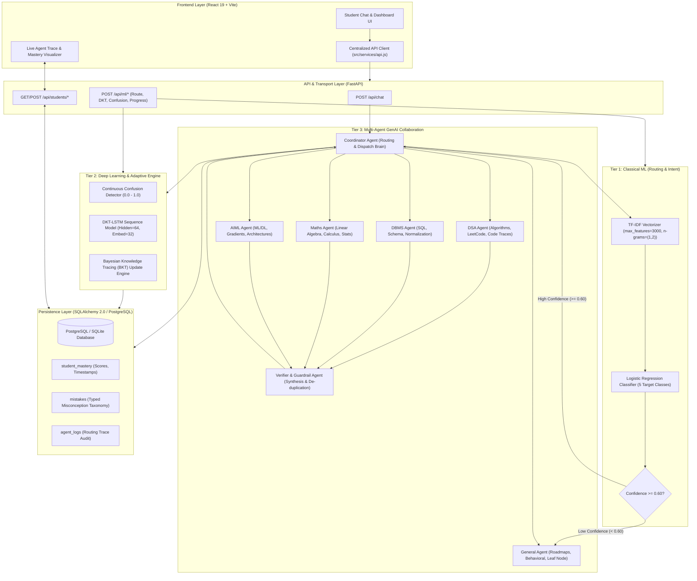
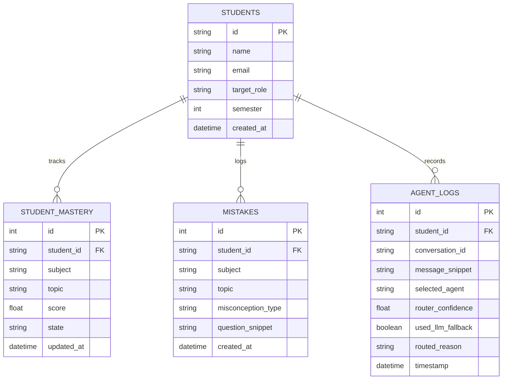

# LearnOS — Master Architecture & Technical Specification Document

---

## Table of Contents
1. [Executive Summary & Vision](#1-executive-summary--vision)
2. [Three-Tier Architecture Overview](#2-three-tier-architecture-overview)
3. [End-to-End System Architecture Diagram](#3-end-to-end-system-architecture-diagram)
4. [Tier 1: Classical Machine Learning (Subject & Intent Router)](#4-tier-1-classical-machine-learning-subject--intent-router)
5. [Tier 2: Deep Learning & Knowledge Tracing (DKT + BKT Progress Engine)](#5-tier-2-deep-learning--knowledge-tracing-dkt--bkt-progress-engine)
6. [Tier 3: Multi-Agent Orchestration & Pedagogical Collaboration](#6-tier-3-multi-agent-orchestration--pedagogical-collaboration)
7. [Database Schema & Data Contracts](#7-database-schema--data-contracts)
8. [API Endpoints & Request/Response Flow](#8-api-endpoints--requestresponse-flow)
9. [Frontend Architecture & Agent Trace Panel](#9-frontend-architecture--agent-trace-panel)
10. [File Structure & Component Mapping](#10-file-structure--component-mapping)

---

## 1. Executive Summary & Vision

**LearnOS** is an intelligent, agentic placement-prep mentor and adaptive learning operating system for Indian engineering students. Unlike standard conversational bots that pass all student queries directly to an expensive LLM, LearnOS implements a **3-Tier AI/ML Hybrid System**:

1. **Deterministic Classical ML**: Near-instant, explainable routing of questions across core placement subjects.
2. **Deep Learning & Bayesian Knowledge Tracing**: Continuous skill mastery estimation ($P(L_t)$) with cross-topic transfer prediction and continuous confusion detection.
3. **Agentic GenAI Collaboration**: Specialized subject agents (DSA, DBMS, Maths, AIML, and General), prerequisite-aware cross-agent handoffs, and a guardrail Verifier agent.

---

## 2. Three-Tier Architecture Overview

| Layer | Technology | Primary Role | Latency / Cost Profile |
|---|---|---|---|
| **Tier 1: Classical ML** | TF-IDF Vectorizer + Logistic Regression | Classifies queries into 5 subject categories (`dsa`, `dbms`, `maths`, `aiml`, `general`). | $< 5\text{ ms}$, Zero API Cost |
| **Tier 2: Deep Learning & Statistics** | PyTorch LSTM (DKT) + Bayesian Knowledge Tracing (BKT) | Tracks sequential student interactions, predicts cross-skill transfer, models confusion, and updates mastery states. | $< 15\text{ ms}$, Local CPU/GPU Inference |
| **Tier 3: Multi-Agent GenAI** | Multi-Agent LLMs (Gemini) with Coordinator & Verifier | Generates step-by-step pedagogical explanations, diagnoses typed misconceptions, traces code, and creates study plans. | LLM Turn Latency, Context-Optimized |

---

## 3. End-to-End System Architecture Diagram



---

## 4. Tier 1: Classical Machine Learning (Subject & Intent Router)

### 4.1 Objective & Model Formulation
Rather than invoking an LLM for every routing decision, LearnOS trains a lightweight text classification model on domain-specific placement-prep queries.

- **Feature Extraction**: TF-IDF Vectorizer with unigrams and bigrams (`ngram_range=(1, 2)`), sublinear TF scaling, and maximum 3,000 features.
- **Classification Algorithm**: Multinomial Logistic Regression (`max_iter=1000`, `C=1.0`).
- **Target Classes**:
  1. `dsa`: Data structures, algorithms, complexity ($O(N)$), LeetCode, recursion.
  2. `dbms`: SQL queries, transactions (ACID), normalization (1NF-BCNF), ER models, indexing.
  3. `maths`: Linear algebra, probability, Bayes theorem, eigenvalues, calculus, discrete math.
  4. `aiml`: Supervised/unsupervised learning, deep neural nets, loss functions, overfitting.
  5. `general`: Placement strategy, behavioral interview prep, roadmaps, ambiguous questions.

### 4.2 Hybrid Routing Logic
```python
# Inference flow in backend/app/agents/router.py
probs = classifier.predict_proba(vectorizer.transform([message]))[0]
best_idx = probs.argmax()
confidence = float(probs[best_idx])
predicted_agent = classifier.classes_[best_idx]

if confidence >= 0.60:
    agent = predicted_agent
else:
    # Fallback to LLM classifier or General leaf node
    agent = llm_classify(message) or "general"
```

---

## 5. Tier 2: Deep Learning & Knowledge Tracing (DKT + BKT Progress Engine)

### 5.1 Deep Knowledge Tracing (DKT-LSTM)
Deep Knowledge Tracing formulates student learning as a sequence-to-sequence prediction problem using a Recurrent Neural Network (LSTM).

- **Architecture**:
  $$\mathbf{x}_t = \text{Embedding}(s_t, y_t)$$
  $$\mathbf{h}_t = \text{LSTM}(\mathbf{x}_t, \mathbf{h}_{t-1})$$
  $$\mathbf{y}_{t+1} = \sigma(\mathbf{W} \mathbf{h}_t + \mathbf{b})$$
  - Input: Sequence of tuples $(s_t, y_t)$ where $s_t \in [0, \dots, K-1]$ represents the skill ID and $y_t \in \{0, 1\}$ represents question correctness.
  - Embedding Dimension: $32$
  - Hidden Dimension: $64$ (PyTorch LSTM layer)
  - Output: Multi-skill mastery probability vector $\mathbf{y}_{t+1} \in [0, 1]^K$ predicting performance on all $K$ skills at step $t+1$.

### 5.2 Bayesian Knowledge Tracing (BKT) Engine
For immediate single-interaction mastery updates, LearnOS applies standard BKT parameter equations:

1. **Posterior Probability of Mastery**:
   $$P(L_t \mid \text{Correct}) = \frac{P(L_{t-1}) \cdot (1 - P(S))}{P(L_{t-1}) \cdot (1 - P(S)) + (1 - P(L_{t-1})) \cdot P(G)}$$
   $$P(L_t \mid \text{Incorrect}) = \frac{P(L_{t-1}) \cdot P(S)}{P(L_{t-1}) \cdot P(S) + (1 - P(L_{t-1})) \cdot (1 - P(G))}$$

2. **Transition with Learning Probability $P(T)$**:
   $$P(L_{t+1}) = P(L_t) + (1 - P(L_t)) \cdot P(T)$$

3. **Hybrid Blending**:
   When interaction history length $N \ge 5$, the final score blends BKT with DKT-LSTM outputs:
   $$\text{Final Mastery} = 0.60 \cdot \text{BKT}_{\text{score}} + 0.40 \cdot \text{DKT}_{\text{score}}$$

### 5.3 Continuous Confusion Detection
- Inputs: Message sentiment polarity, prompt hesitation, question length, repeated errors on the same concept.
- Output: Continuous score $C \in [0.0, 1.0]$.
- Pedagogical Actions:
  - $C < 0.3$: Direct Socratic inquiry.
  - $0.3 \le C < 0.7$: Step-by-step worked example.
  - $C \ge 0.7$: Real-world analogy with prerequisite escalation.

---

## 6. Tier 3: Multi-Agent Orchestration & Pedagogical Collaboration

### 6.1 Agent Taxonomy & Specialization

```
                          ┌───────────────────────────┐
                          │     Coordinator Agent     │
                          │   (Hybrid Router Brain)   │
                          └─────────────┬─────────────┘
                                        │
         ┌──────────────┬───────────────┼───────────────┬──────────────┐
         ▼              ▼               ▼               ▼              ▼
   ┌───────────┐  ┌───────────┐   ┌───────────┐   ┌───────────┐  ┌───────────┐
   │    DSA    │  │   DBMS    │   │   Maths   │   │   AIML    │  │  General  │
   │ Specialist│  │ Specialist│   │ Specialist│   │ Specialist│  │ (Leaf Node│
   └─────┬─────┘  └─────┬─────┘   └─────┬─────┘   └─────┬─────┘  └───────────┘
         │              │               │               │
         └──────────────┴───────┬───────┴───────────────┘
                                │ (Multi-Agent Outputs)
                                ▼
                  ┌───────────────────────────┐
                  │ Verifier & Guardrail Agent│
                  │ (Synthesize & Deduplicate)│
                  └─────────────┬─────────────┘
                                │
                                ▼
                       Student-Facing Output
```

1. **DSA Agent**: Algorithmic problem solving, Big-O complexity in LaTeX ($O(N \log N)$), syntax-highlighted code execution traces.
2. **DBMS Agent**: SQL query construction, schema normalization (1NF to BCNF), indexing trade-offs, ER diagram translations.
3. **Maths Agent**: Probability, linear algebra, calculus proofs, eigenvalue decompositions formatted in standard LaTeX ($inline$ and $$block$$).
4. **AIML Agent**: Model architectures, loss function derivations, gradient descent intuition, backpropagation dynamics.
5. **General Agent (Leaf Node)**: Behavioral interview preparation, study roadmaps synthesized directly from database mastery snapshots. **Hard Rule**: General is a leaf node — it never hands off questions mid-turn.
6. **Verifier & Guardrail Agent**: Synthesizes multiple specialist drafts into a single cohesive response, removes contradictions, and enforces formatting integrity.

### 6.2 Typed Misconception Taxonomy
Wrong answers are tagged against a closed, typed taxonomy rather than arbitrary free text:
- `sign_error`
- `unit_confusion`
- `definition_confusion`
- `off_by_one`
- `base_case_missing`
- `formula_misapplication`
- `logic_error`
- `other`

---

## 7. Database Schema & Data Contracts

### 7.1 Entity Relationship Model



---

## 8. API Endpoints & Request/Response Flow

### 8.1 Primary Endpoints

| Endpoint | Method | Input Schema | Output Schema | Description |
|---|---|---|---|---|
| `/api/chat` | `POST` | `ChatRequest` | `ChatResponse` | Main conversational endpoint. Coordinates routing, specialist answering, and trace logging. |
| `/api/ml/route` | `POST` | `RouteRequest` | `RouteResponse` | Direct Tier-1 classifier endpoint for testing routing latency and confidence. |
| `/api/ml/confusion` | `POST` | `ConfusionRequest` | `ConfusionResponse` | Evaluates message text and conversation context to return confusion index $[0.0 - 1.0]$. |
| `/api/ml/dkt-mastery` | `POST` | `DKTSequenceRequest` | `DKTSequenceResponse` | PyTorch DKT-LSTM inference for a sequence of interaction tuples. |
| `/api/ml/progress-update`| `POST` | `ProgressUpdateRequest`| `ProgressUpdateResponse` | Executes BKT/DKT hybrid progress formula and returns updated mastery state. |
| `/api/ml/skills` | `GET` | *None* | `SkillsCatalogResponse` | Returns ID-to-skill name mapping recognized by the DKT model. |
| `/api/students/{id}/mastery` | `GET` | *None* | `List[MasteryItem]` | Returns current mastery scores across all subjects and topics for a student. |

---

## 9. Frontend Architecture & Agent Trace Panel

The frontend is built using **React 19** and **Vite** with a modular component architecture:

```
frontend/src/
├── components/
│   ├── Header.jsx             # System status indicator, student profile header
│   ├── StatusCard.jsx         # Live backend & ML subsystem health indicators
│   ├── QuickActions.jsx       # Interactive FastAPI /docs, ReDoc, and Swagger shortcuts
│   └── ArchitectureGuide.jsx  # Interactive system architecture walkthrough
├── pages/
│   └── Dashboard.jsx          # Central dashboard view orchestrating panels
├── services/
│   └── api.js                 # Centralized fetch client wrapper for all backend routes
├── index.css                  # Tokenized CSS design system (Dark mode, glassmorphism)
└── main.jsx                   # React root entry point
```

### 9.1 The "Agent Trace" Live Visualizer
The Agent Trace Panel renders the internal reasoning pipeline directly to the student or hackathon judge:
- **Routing Decision Badge**: Shows chosen agent (`DSA`, `DBMS`, `AIML`, `Maths`, `General`).
- **Confidence Meter**: Visual bar showing classifier certainty percentage (e.g. `89.4%`).
- **Execution Path**: Displays whether the response used fast Classical ML or LLM fallback.
- **Pedagogical Strategy**: Indicates current teaching mode (`Socratic`, `Worked Example`, `Analogy`).

---

## 10. File Structure & Component Mapping

```
hackathon-starter/
├── backend/
│   ├── app/
│   │   ├── agents/            # Tier 3: Coordinator, Specialists, Prompts, Verifier
│   │   │   ├── aiml_agent.py
│   │   │   ├── base.py
│   │   │   ├── coordinator.py
│   │   │   ├── dbms_agent.py
│   │   │   ├── dsa_agent.py
│   │   │   ├── general_agent.py
│   │   │   ├── llm_client.py
│   │   │   ├── maths_agent.py
│   │   │   ├── prompts.py
│   │   │   ├── router.py
│   │   │   └── verifier_agent.py
│   │   ├── ml_models/         # Serialized Joblib & PyTorch model artifacts
│   │   ├── models/            # SQLAlchemy database models (Student, Mastery, Mistakes)
│   │   ├── routes/            # FastAPI route controllers (api, chat, ml, health, students)
│   │   ├── schemas/           # Pydantic data validation schemas
│   │   ├── services/          # Business logic & ML inference wrappers
│   │   └── main.py            # FastAPI app initialization & CORS middleware
│   └── requirements.txt
├── ml/
│   ├── confusion/             # Confusion detection algorithms
│   ├── dkt/                   # PyTorch DKT-LSTM training scripts & configs
│   ├── progress_engine/       # BKT + DKT progress update math engine
│   ├── router/                # Synthetic training data generator & vectorizers
│   ├── notebooks/             # Step-by-step Jupyter notebooks for model training
│   └── train_all_models.py    # Unified one-click training script
├── frontend/                  # React 19 + Vite UI
└── docs/
    └── LEARNOS_COMPLETE_ARCHITECTURE.md
```
